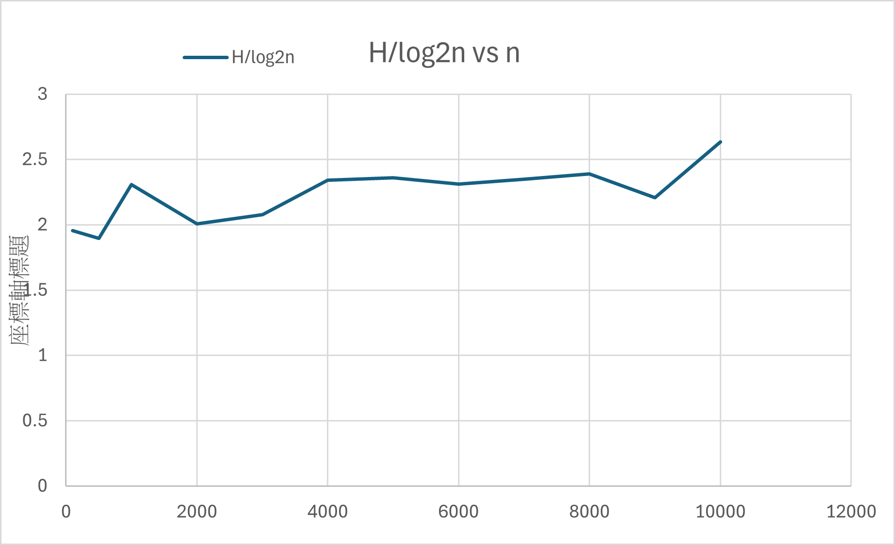

# 41343121

## 作業一 Max/Min Heap

## 解題說明
將課堂所學的MaxHeap實作MinHeap並以MinPQ的架構去編寫
### 解題策略
目標:將 n 個整數插入 Min-Heap，最後以二元樹的陣列表示輸出
1. 先定義 ADT：MinPQ<T>（抽象類別）
   
   - IsEmpty()：判斷是否為空
   - Top()：回傳目前最小值
   - Push(x)：插入元素
   - Pop()：刪除最小值
  
2. 實作 MinPQ<T>：class MinHeap : public MinPQ<T>
資料結構選擇：


   - 用陣列 heap 存完全二元樹

   - 採 1-based indexing：根節點在 heap[1]

      - parent = i/2
      - left child = 2*i
      - right child = 2*i + 1
## 程式實作

### IDE:
Microsoft Visual Studio Code C/C++

```cpp
#include <iostream>
#include <string>
using namespace std;

template <class T>
class MinPQ {
public:
    virtual ~MinPQ() {}
    virtual bool IsEmpty() const = 0;
    virtual const T& Top() const = 0;
    virtual void Push(const T& x) = 0;
    virtual void Pop() = 0;
};

template <class T>
class MinHeap : public MinPQ<T> {
private:
    T* heap;       
    int heapSize;
    int capacity;

    void ChangeSize1D(int newCapacity) {
        if (newCapacity < 1) newCapacity = 1;

        T* newHeap = new T[newCapacity + 1];
        int copySize = (heapSize < newCapacity) ? heapSize : newCapacity;

        for (int i = 1; i <= copySize; i++) newHeap[i] = heap[i];

        delete[] heap;
        heap = newHeap;
        capacity = newCapacity;

        if (heapSize > capacity) heapSize = capacity;
    }

public:
    explicit MinHeap(int theCapacity = 10)
        : heap(nullptr), heapSize(0), capacity(theCapacity) {
        if (capacity < 1) capacity = 1;
        heap = new T[capacity + 1];
    }

    ~MinHeap() override { delete[] heap; }

    bool IsEmpty() const override { return heapSize == 0; }

    const T& Top() const override {
        if (IsEmpty()) throw string("MinHeap::Top: heap is empty");
        return heap[1];
    }

    void Push(const T& x) override {
        if (heapSize == capacity) ChangeSize1D(capacity * 2);

        int currentNode = ++heapSize;
        while (currentNode != 1 && x < heap[currentNode / 2]) {
            heap[currentNode] = heap[currentNode / 2];
            currentNode /= 2;
        }
        heap[currentNode] = x;
    }

    void Pop() override {
        if (IsEmpty()) throw string("MinHeap::Pop: heap is empty");

        T lastE = heap[heapSize--];

        int currentNode = 1;
        int child = 2;

        while (child <= heapSize) {
            if (child < heapSize && heap[child] > heap[child + 1]) child++;
            if (lastE <= heap[child]) break;

            heap[currentNode] = heap[child];
            currentNode = child;
            child *= 2;
        }
        heap[currentNode] = lastE;
    }

    void PrintArray() const {
        for (int i = 1; i <= heapSize; i++) {
            cout << heap[i];
            if (i != heapSize) cout << " ";
        }
        cout << "\n";
    }
};

int main() {
    int n;
    cin >> n;

    MinHeap<int> h((n > 10) ? n : 10);

    for (int i = 0; i < n; i++) {
        int x;
        cin >> x;
        h.Push(x);
    }

    h.PrintArray();

    return 0;
}
```

## 效能分析
1. 空間複雜度：
   - 總空間複雜度：O(n)
2. 時間複雜度：
   - IsEmpty()：O(1)
   - Top()：O(1)
   - Push(x)：O(log n)
   - Pop()：O(log n)
   - PrintArray():O(n)
## 測試與驗證

### 測試案例 

| 測試案例 | 輸入參數   | 預期輸出 | 實際輸出 |
|----------|--------------|----------|----------|
| 測試一   |5<br>5 3 1 8 6   | 1 5 3 8 6     |  1 5 3 8 6        |


### 測試輸入
```
5
5 3 1 8 6
```
### 測試輸出
```
1 5 3 8 6
```
### 結論
本次作業以Min-Heap實作最小優先佇列 MinPQ。利用堆的性質可讓最小值永遠位於根節點heap[1]，使用:

- IsEmpty：判斷 heap 是否為空

- Top（取最小值）：回傳最小元素（root）

- Push（插入)：若已滿使用擴容,插入到最後並往上調整

- Pop（刪除最小值）：把最後一個元素拿出,放到 root往下調整


## 申論及開發報告
本題目要求先撰寫一個最小優先佇列的抽象類別 MinPQ<T>，其功能包含判斷是否為空、取得最小元素、插入元素、刪除最小元素等基本操作；再以最小堆（Min-Heap）實作具體類別 MinHeap<T>，並完成所有虛擬函式。

使用了跟MaxHeap 一致的程式架構，本實作採用陣列表示完全二元樹
最小堆需滿足堆序性質：任一節點的值皆小於等於其子節點，因此根節點即為全堆最小值。插入與刪除操作會破壞堆序，必須透過「Push上濾」與「Pop下濾」恢復堆的結構與堆序，並確保各操作複雜度與 MaxHeap 對應一致。
### 優點

- 時間效率好、符合題目複雜度
- 資料結構簡單、實作直觀
- 可動態擴充容量

### 缺點
- 記憶體管理較容易出錯
- 擴充容量的代價（單次可能 O(n)）
   -擴充時會配置新陣列並複製資料，單次成本是 O(n)。不過平均而言，插入仍可視為接近 O(log n)擴充時會有額外複製成本。

--------------------------------------------------------------------------------------------------------------------------------------------------------------------

## 作業一 Binary Search Tree

## 解題說明
(a)本題利用 Binary Search Tree（BST），在隨機插入資料的情況下，觀察樹的高度隨節點數 n 的變化。
- 對多個不同的節點數 𝑛（100 ~ 10000）進行測試
- 每個 𝑛：
   - 建立一棵空的 BST
   - 插入 𝑛 個隨機 key（均勻分布）
   - 計算該 BST 的高度
- 計算：
   - $\log_2 n$
- 輸出：
   - 高度(H)
   - 比值：H/ $\log_2 n$

  
(b) 寫一個 C++ 函數，從二元搜尋樹中刪除鍵為 k 的鍵值對。該函數的時間複雜度。
### 解題策略
(a)
- 使用隨機輸入模擬「平均情況」
- 程式每個 (n) 只進行一次
- 用 log₂(n) 作為理論基準
- 比值分析: H/ $\log_2 n$

(b)
刪除節點
- 先用 BST 性質找到要刪的節點
   - 若 k < node->key：要刪的在左子樹 → 遞迴/迭代往左
   - 若 k > node->key：在右子樹 → 往右
   - 若相等：找到了要刪的節點
  
- 找到目標節點後，分 3 大類
   - 情況 A：沒有子節點（葉子）:直接 delete node，回傳 NULL（表示這個位置變空）
   - 情況 B：只有一個子節點:
      - 如果只有右子樹：用右子樹接回來（回傳 node->right）
      - 如果只有左子樹：用左子樹接回來（回傳 node->left）
      - 然後把原本 node delete
   - 情況 C：左右子樹都有 常見兩種標準作法，擇一即可：
      - 用「右子樹最小值」 取代或用「左子樹最大值」 取代 對稱作法
  
## 程式實作
(a)
### IDE:
Microsoft Visual Studio Code C/C++


```cpp
#include <algorithm>
#include <cmath>
#include <cstdio>
#include <cstdlib>
#include <iostream>
using namespace std;

struct Node {
    int key;
    Node* left;
    Node* right;
    explicit Node(int k) : key(k), left(NULL), right(NULL) {}
};

class BST {
public:
    BST() : root(NULL) {}
    ~BST() { clear(root); }

    void insert(int key) { root = insertRec(root, key); }
    void erase(int key) { root = deleteRec(root, key); }
    int height() const { return heightRec(root); }

private:
    Node* root;

    static Node* insertRec(Node* node, int key) {
        if (node == NULL) return new Node(key);
        if (key < node->key) node->left = insertRec(node->left, key);
        else if (key > node->key) node->right = insertRec(node->right, key);
        return node;
    }

    static int heightRec(Node* node) {
        if (node == NULL) return 0;
        int hl = heightRec(node->left);
        int hr = heightRec(node->right);
        return 1 + (hl > hr ? hl : hr);
    }

    static Node* findMin(Node* node) {
        while (node && node->left) node = node->left;
        return node;
    }

    static Node* deleteRec(Node* node, int key) {
        if (node == NULL) return NULL;

        if (key < node->key) node->left = deleteRec(node->left, key);
        else if (key > node->key) node->right = deleteRec(node->right, key);
        else {
            if (node->left == NULL && node->right == NULL) {
                delete node;
                return NULL;
            }
            else if (node->left == NULL) {
                Node* r = node->right;
                delete node;
                return r;
            }
            else if (node->right == NULL) {
                Node* l = node->left;
                delete node;
                return l;
            }
            else {
                Node* succ = findMin(node->right);
                node->key = succ->key;
                node->right = deleteRec(node->right, succ->key);
            }
        }
        return node;
    }

    static void clear(Node* node) {
        if (!node) return;
        clear(node->left);
        clear(node->right);
        delete node;
    }
};

static int uniformKey(int KEY_MAX) {
    unsigned int a = (unsigned int)rand();
    unsigned int b = (unsigned int)rand();
    unsigned int x = (a << 16) ^ b;
    return (int)(x % (unsigned int)KEY_MAX) + 1;
}

int main() {
    srand(123456);
    const int KEY_MAX = 1000000000;

    int ns[] = { 100, 500, 1000, 2000, 3000, 4000, 5000, 6000, 7000, 8000, 9000, 10000 };
    int m = (int)(sizeof(ns) / sizeof(ns[0]));

    cout << "n,H,H/log2n\n";

    for (int idx = 0; idx < m; idx++) {
        int n = ns[idx];
        BST tree;
        for (int i = 0; i < n; i++) tree.insert(uniformKey(KEY_MAX));
        

        double H = (double)tree.height();
        double log2n = log((double)n) / log(2.0);
        double ratio = H / log2n;

        printf("%d,%g,%.6f\n", n, H, ratio);
    }
    return 0;
}

```
(b)在(a)裡面增加
```cpp
struct Node {
    int key;
    Node* left;
    Node* right;
    explicit Node(int k) : key(k), left(NULL), right(NULL) {}
};

class BST {
public:
    BST() : root(NULL) {}

   
    void erase(int key) { root = deleteRec(root, key); }

private:
    Node* root;

   
    static Node* findMin(Node* node) {
        while (node && node->left) node = node->left;
        return node;
    }

    
    static Node* deleteRec(Node* node, int key) {
        if (node == NULL) return NULL;

        if (key < node->key) {
            node->left = deleteRec(node->left, key);
        } else if (key > node->key) {
            node->right = deleteRec(node->right, key);
        } else {
            
            if (node->left == NULL && node->right == NULL) {
                
                delete node;
                return NULL;
            } else if (node->left == NULL) {
               
                Node* r = node->right;
                delete node;
                return r;
            } else if (node->right == NULL) {
               
                Node* l = node->left;
                delete node;
                return l;
            } else {
                
                Node* succ = findMin(node->right);
                node->key = succ->key;
                node->right = deleteRec(node->right, succ->key);
            }
        }
        return node;
    }
};
```
## 效能分析
(a)
空間複雜度：
| 類型              | 複雜度             |
| --------------- | --------------- |
| 樹儲存             | O(n)            |
| recursion stack | O(log n) ~ O(n) |

時間複雜度： 
 |操作      | 平均時間     | 最壞時間 |
| ------- | -------- | ---- |
| insert  | O(log n) | O(n) |
| findMin | O(log n) | O(n) |
| height  | O(n)     | O(n) |
| clear   | O(n)     | O(n) |

(b)
時間複雜度： 
|操作      | 平均時間     | 最壞時間 |
| ------- | -------- |  -------- | 
| delete  | O(log n) | O(n) |

## 測試與驗證

### 測試案例

| 測資 | 輸入參數n (題目自訂)| 預期輸出  H, H/ $\log_2 n$ | 實際輸出 H, H/ $\log_2 n$  |
|----------|--------------|----------|----------|
| 測試一   |100|   13 ,1.956695  |   13 ,1.956695 |
| 測試二   | 500 |  17,1.896097 |   17,1.896097   |
| 測試三   |1000 |23,2.307897 |  23,2.307897|
| 測試四   |2000 | 22,2.006240|22,2.006240 |
| 測試五   |3000 | 24,2.077788| 24,2.077788|
| 測試六   |4000 | 28,2.340005 |28,2.340005 |
| 測試七   |5000 | 29,2.360081| 29,2.360081 |
| 測試八  | 6000|29,2.310619|29,2.310619 |
| 測試九  | 7000|30,2.348679  | 30,2.348679|
| 測試十   | 8000| 31,2.390908|31,2.390908  |
| 測試十一  |9000 |29,2.207722 | 29,2.207722 |
| 測試十二   | 10000| 35,2.634012|35,2.634012  |

### 測試輸出

```
n,H,H/log2n
100,13,1.956695
500,17,1.896097
1000,23,2.307897
2000,22,2.006240
3000,24,2.077788
4000,28,2.340005
5000,29,2.360081
6000,29,2.310619
7000,30,2.348679
8000,31,2.390908
9000,29,2.207722
10000,35,2.634012
```

### 結論
本實驗透過對不同規模𝑛的資料進行隨機插入，對每個不同的 (n) 建立一棵 Binary Search Tree（BST）
，並計算其高度，進一步與 
  $\log_2$(n) 進行比較分析。

## 申論及開發報告
本實驗不僅實作 BST，更重要的是透過實驗方式驗證理論分析結果。
理論上，BST 的操作效率取決於樹高，在最壞情況下可能退化為 𝑂(𝑛)，但在隨機輸入下，其期望高度為 𝑂(log⁡𝑛)從實驗結果可觀察到：
- 高度隨 𝑛增加呈現緩慢上升
- 與 log⁡𝑛成長趨勢一致
- 比值趨於穩定常數
### 優點
- 能驗證理論（log n 成長）
- 使用隨機化，貼近實務情境
- 實作簡單、易於擴充
### 缺點
- 高度計算成本高
- 亂數品質有限
- 記憶體與遞迴風險

