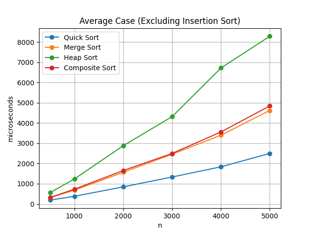
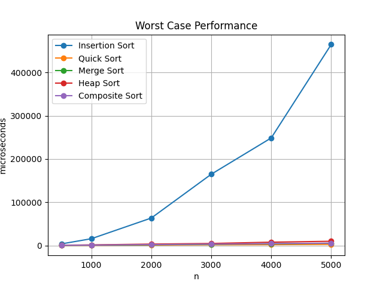
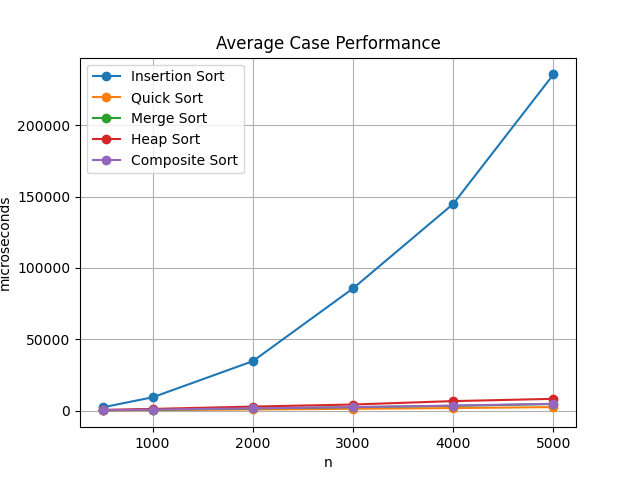

# 41343112
# 41343121

## 作業三 Sorting Project

## 解題說明

本題目主要目標為實作多種排序演算法，並比較其在不同輸入資料與不同資料量下的執行效能。程式中共實作五種排序演算法：

1. Insertion Sort  
2. Quick Sort（Median-of-Three）  
3. Iterative Merge Sort  
4. Heap Sort  
5. Composite Sort  

其中 Composite Sort 會根據資料量選擇不同排序策略，以提升整體排序效能。

程式同時包含：

- Worst-case Test
- Average-case Test
- Correctness Test
- 計時系統
- 結果輸出

---

## 解題策略

### 1. Insertion Sort

Insertion Sort 採用逐步插入方式進行排序。

策略如下：

- 從第二個元素開始
- 將元素插入左側已排序區域
- 將大於 key 的元素向右移動

此方法在小型資料下具有較低的常數成本，因此 Composite Sort 中也將其用於小型資料排序。

---

### 2. Quick Sort

Quick Sort 是一種分治法（Divide and Conquer）的排序演算法，流程如下：

1. 選擇基準值（pivot）
2. 將資料依 pivot 分割為左右兩部分
3. 對左右子區間遞迴排序

本程式採用「Median-of-Three」方式選擇 pivot：

- 從左側、中間與右側三個元素中取中位數作為 pivot
- 可降低因輸入資料接近排序完成而導致效能退化為 O(n²) 的機率

此外，當子區間長度小於 16 時，會改用 Insertion Sort，以降低遞迴與分割（partition）的額外成本。這是一種常見的 Hybrid Optimization 技術。

---

### 3. Iterative Merge Sort

本程式採用迭代式（Iterative）Merge Sort，而非遞迴實作方式。

實作流程如下：

- 初始時將每個元素視為長度為 1 的已排序區塊
- 接著依序合併長度為 2、4、8、16 的區塊
- 重複執行直到整個陣列完成排序

此方法可避免深層遞迴造成的函式呼叫成本。

---

### 4. Heap Sort

Heap Sort 會先將資料整理成 Max Heap，再進行排序。

基本流程如下：

1. 將所有元素建構成 Max Heap
2. 取出堆頂元素（最大值）並放置至陣列尾端
3. 將 Heap 大小減 1，並重新調整 Heap 結構
4. 重複步驟 2 至 3，直到排序完成

透過反覆將最大值移至陣列尾端，最終完成排序。

---

### 5. Composite Sort

Composite Sort 採用混合式排序（Hybrid Sort）概念，根據資料量選擇不同排序策略：

- 當資料量小於等於 32 時，使用 Insertion Sort
- 當資料量大於 32 時，使用 Merge Sort

由於 Insertion Sort 在小型資料下具有較低常數成本，因此能提升整體排序表現。

---
## 程式實作

### IDE:
Microsoft Visual Studio Code C/C++

```cpp
#include <algorithm>  
#include <chrono>     
#include <iomanip>    
#include <iostream>   
#include <numeric>    
#include <random>     
#include <string>     
#include <vector>     

using namespace std;  

using Clk = chrono::high_resolution_clock;   
using Us = chrono::duration<double, micro>;  

enum ST { INS, QCK, MRG, HEP, CMP };  

struct R {          
    int n;          
    string alg;     
    string kind;    
    double us;      
    int times;      
};

mt19937 gen(20260524);  

string nm(ST t) {                         
    if (t == INS) return "Insertion Sort"; 
    if (t == QCK) return "Quick Sort";     
    if (t == MRG) return "Merge Sort";     
    if (t == HEP) return "Heap Sort";      
    if (t == CMP) return "Composite Sort"; 
    return "Unknown";                      
}

vector<int> seq(int n) {          
    vector<int> a(n);             
    iota(a.begin(), a.end(), 1);  
    return a;                     
}

vector<int> rev(int n) {          
    vector<int> a(n);             
    for (int i = 0; i < n; i++) { 
        a[i] = n - i;             
    }
    return a;                     
}

vector<int> rnd(int n) {                 
    vector<int> a = seq(n);              
    shuffle(a.begin(), a.end(), gen);    
    return a;                            
}

void ins(vector<int>& a) {                    
    for (int i = 1; i < (int)a.size(); i++) { 
        int key = a[i];                       
        int j = i - 1;                        
        while (j >= 0 && a[j] > key) {        
            a[j + 1] = a[j];                  
            j--;                             
        }
        a[j + 1] = key;                      
    }
}

int med3(vector<int>& a, int l, int r) { 
    int m = l + (r - l) / 2;             
    if (a[m] < a[l]) swap(a[m], a[l]);   
    if (a[r] < a[l]) swap(a[r], a[l]);   
    if (a[r] < a[m]) swap(a[r], a[m]);   
    swap(a[m], a[r - 1]);                
    return a[r - 1];                     
}

void qrec(vector<int>& a, int l, int r) { 
    int cut = 16;                         
    if (l + cut <= r) {                   
        int p = med3(a, l, r);            
        int i = l;                       
        int j = r - 1;                    
        while (true) {                    
            while (a[++i] < p) {          
            }
            while (p < a[--j]) {          
            }
            if (i < j) {                  
                swap(a[i], a[j]);         
            }
            else {                      
                break;                    
            }
        }
        swap(a[i], a[r - 1]);             
        qrec(a, l, i - 1);                
        qrec(a, i + 1, r);               
    }
    else {                              
        for (int x = l + 1; x <= r; x++) {
            int key = a[x];               
            int y = x - 1;                
            while (y >= l && a[y] > key) {
                a[y + 1] = a[y];          
                y--;                      
            }
            a[y + 1] = key;              
        }
    }
}

void qck(vector<int>& a) {             
    if (a.size() > 1) {                
        qrec(a, 0, (int)a.size() - 1); 
    }
}

void mrg(vector<int>& a) {                 
    int n = (int)a.size();                 
    vector<int> tmp(n);                   
    for (int w = 1; w < n; w *= 2) {       
        for (int l = 0; l < n; l += 2 * w) {
            int m = min(l + w, n);         
            int r = min(l + 2 * w, n);     
            int i = l;                     
            int j = m;                    
            int k = l;                    
            while (i < m && j < r) {     
                if (a[i] <= a[j]) {      
                    tmp[k] = a[i];        
                    i++;                  
                }
                else {                  
                    tmp[k] = a[j];       
                    j++;                 
                }
                k++;                      
            }
            while (i < m) {               
                tmp[k++] = a[i++];       
            }
            while (j < r) {               
                tmp[k++] = a[j++];        
            }
            for (int x = l; x < r; x++) {  
                a[x] = tmp[x];             
            }
        }
    }
}

void down(vector<int>& a, int s, int e) { 
    int root = s;                         
    while (root * 2 + 1 <= e) {          
        int lc = root * 2 + 1;            
        int rc = lc + 1;                  
        int big = root;                  
        if (a[big] < a[lc]) {            
            big = lc;                    
        }
        if (rc <= e && a[big] < a[rc]) { 
            big = rc;                     
        }
        if (big == root) {               
            return;                      
        }
        swap(a[root], a[big]);            
        root = big;                      
    }
}

void heap(vector<int>& a) {                   
    int n = (int)a.size();                     
    for (int s = n / 2 - 1; s >= 0; s--) {     
        down(a, s, n - 1);                     
    }
    for (int e = n - 1; e > 0; e--) {         
        swap(a[0], a[e]);                      
        down(a, 0, e - 1);                     
    }
}

void cmp(vector<int>& a) { 
    int n = (int)a.size(); 
    if (n <= 32) {         
        ins(a);            
    }
    else {               
        mrg(a);            
    }
}

void run(ST t, vector<int>& a) {  
    if (t == INS) ins(a);         
    else if (t == QCK) qck(a);    
    else if (t == MRG) mrg(a);    
    else if (t == HEP) heap(a);  
    else if (t == CMP) cmp(a);   
}

bool ok(ST t) {                         
    vector<vector<int>> tests = {       
        {},                            
        {1},                            
        {2, 1},                         
        {5, 1, 3, 3, 2, 9, 0},          
        rev(100),                       
        rnd(257)                        
    };
    for (vector<int> a : tests) {       
        vector<int> ans = a;           
        sort(ans.begin(), ans.end());   
        run(t, a);                      
        if (a != ans) {                 
            return false;               
        }
    }
    return true;                        
}

double rpt(ST t, const vector<int>& src, int& times) { 
    times = 1;                                         
    double total = 0.0;                               
    while (times <= 1048576) {                         
        auto st = Clk::now();                          
        for (int i = 0; i < times; i++) {             
            vector<int> a = src;                       
            run(t, a);                                 
        }
        auto ed = Clk::now();                          
        total = Us(ed - st).count();                   
        if (total >= 100000.0) {                      
            break;                                     
        }
        times *= 2;                                   
    }
    return total / times;                              
}

vector<int> mwRec(const vector<int>& s) {      
    int n = (int)s.size();                     
    if (n <= 1) {                              
        return s;                              
    }
    vector<int> l;                             
    vector<int> r;                             
    for (int i = 0; i < n; i++) {              
        if (i % 2 == 0) {                      
            l.push_back(s[i]);                 
        }
        else {                              
            r.push_back(s[i]);                 
        }
    }
    l = mwRec(l);                              
    r = mwRec(r);                              
    l.insert(l.end(), r.begin(), r.end());     
    return l;                                
}

vector<int> wdata(ST t, int n) { 
    if (t == INS) {              
        return rev(n);          
    }
    if (t == MRG) {              
        return mwRec(seq(n));    
    }
    return rnd(n);               
}

vector<R> testCase(ST t, int n, int rt) {       
    vector<vector<int>> samples;                

    samples.push_back(wdata(t, n));             

    for (int i = 0; i < rt; i++) {              
        samples.push_back(rnd(n));             
    }

    double total = 0.0;                        
    double mx = 0.0;                            
    int usedTimes = 0;                         

    for (vector<int> a : samples) {             
        int times = 1;                          
        double now = rpt(t, a, times);          
        total += now;                           
        mx = max(mx, now);                     
        usedTimes = max(usedTimes, times);      
    }

    double mean = total / samples.size();     
    vector<R> ans;                              
    ans.push_back({ n, nm(t), "worst", mx, usedTimes });      
    ans.push_back({ n, nm(t), "average", mean, (int)samples.size() }); 
    return ans;                                 
}

void show(const vector<R>& rs) {                    
    cout << fixed << setprecision(3);              
    cout << "\nTiming summary, microseconds per sort\n";
    cout << "n,algorithm,data_kind,microseconds,trials\n"; 
    for (R x : rs) {                                
        cout << x.n << ","                         
            << x.alg << ","                       
            << x.kind << ","                      
            << x.us << ","                       
            << x.times << "\n";                   
    }
}

int main() {                                                   
    vector<ST> algs = { INS, QCK, MRG, HEP, CMP };               
    vector<int> ns = { 500, 1000, 2000, 3000, 4000, 5000 };     
    vector<R> rs;                                              
    cout << "Timer: chrono::high_resolution_clock\n";          
    cout << "Clock accuracy estimate: "                       
        << (double)Clk::period::num / Clk::period::den * 1000000.0 
        << " microseconds per tick\n";                        
    for (ST t : algs) {                                       
        if (!ok(t)) {                                          
            cout << nm(t) << " failed correctness test.\n";    
            return 1;                                         
        }
    }
    cout << "Correctness tests passed.\n";                     
    for (int n : ns) {                                         
        int rt = max(10, 10000 / n);                           
        for (ST t : algs) {                                    
            vector<R> tmp = testCase(t, n, rt);                
            rs.push_back(tmp[0]);                              
            rs.push_back(tmp[1]);                              
        }
    }
    show(rs);                                                  
    cout << "\nFinished. Copy these results into Excel or your report if needed.\n"; 
    return 0;                                                  
}

```
## 效能分析

### 時間複雜度比較

| 排序法 | 最佳情況 | 平均情況 | 最壞情況 |
|---|---|---|---|
| Insertion Sort | O(n) | O(n²) | O(n²) |
| Quick Sort | O(n log n) | O(n log n) | O(n²) |
| Merge Sort | O(n log n) | O(n log n) | O(n log n) |
| Heap Sort | O(n log n) | O(n log n) | O(n log n) |
| Composite Sort | O(n log n) | O(n log n) | O(n log n) |

- Insertion Sort 在資料接近排序完成時具有較佳效率，但在反向排列情況下會退化為 O(n²)。
- Quick Sort 在平均情況下具有良好效能，但若 pivot 選擇不佳，仍可能退化為 O(n²)。
- Merge Sort 的時間複雜度穩定維持在 O(n log n)。
- Heap Sort 的效能較不易受到輸入資料排列方式影響。
- Composite Sort 結合不同排序法的特性，以提升不同資料規模下的排序表現。

---

### 空間複雜度比較

| 排序法 | 空間複雜度 |
|---|---|
| Insertion Sort | O(1) |
| Quick Sort | O(log n) |
| Merge Sort | O(n) |
| Heap Sort | O(1) |
| Composite Sort | O(n) |

- Merge Sort 需要額外 O(n) 空間作為合併時的暫存陣列。
- Heap Sort 與 Insertion Sort 屬於 in-place sorting，因此額外空間需求較低。

---

### 效能實驗結果

下表為實際測試資料（單位：微秒）：

| n    | Algorithm       | Data Kind   | Microseconds | Trials |
|------|-----------------|-------------|--------------|--------|
| 500  | Insertion Sort  | worst       | 3680.944     | 64     |
| 500  | Insertion Sort  | average     | 2322.332     | 21     |
| 500  | Quick Sort      | worst       | 250.905      | 1024   |
| 500  | Quick Sort      | average     | 195.169      | 21     |
| 500  | Merge Sort      | worst       | 469.889      | 512    |
| 500  | Merge Sort      | average     | 317.856      | 21     |
| 500  | Heap Sort       | worst       | 626.263      | 256    |
| 500  | Heap Sort       | average     | 560.689      | 21     |
| 500  | Composite Sort  | worst       | 395.663      | 512    |
| 500  | Composite Sort  | average     | 319.426      | 21     |
| 1000 | Insertion Sort  | worst       | 15679.163    | 16     |
| 1000 | Insertion Sort  | average     | 9384.032     | 11     |
| 1000 | Quick Sort      | worst       | 409.291      | 512    |
| 1000 | Quick Sort      | average     | 381.249      | 11     |
| 1000 | Merge Sort      | worst       | 770.983      | 256    |
| 1000 | Merge Sort      | average     | 682.466      | 11     |
| 1000 | Heap Sort       | worst       | 1327.406     | 128    |
| 1000 | Heap Sort       | average     | 1237.367     | 11     |
| 1000 | Composite Sort  | worst       | 949.805      | 256    |
| 1000 | Composite Sort  | average     | 733.944      | 11     |
| 2000 | Insertion Sort  | worst       | 63533.400    | 4      |
| 2000 | Insertion Sort  | average     | 34689.420    | 11     |
| 2000 | Quick Sort      | worst       | 945.939      | 128    |
| 2000 | Quick Sort      | average     | 847.318      | 11     |
| 2000 | Merge Sort      | worst       | 1739.652     | 128    |
| 2000 | Merge Sort      | average     | 1565.903     | 11     |
| 2000 | Heap Sort       | worst       | 3282.272     | 64     |
| 2000 | Heap Sort       | average     | 2879.865     | 11     |
| 2000 | Composite Sort  | worst       | 2119.083     | 128    |
| 2000 | Composite Sort  | average     | 1653.427     | 11     |
| 3000 | Insertion Sort  | worst       | 164849.600   | 2      |
| 3000 | Insertion Sort  | average     | 85672.714    | 11     |
| 3000 | Quick Sort      | worst       | 1673.370     | 128    |
| 3000 | Quick Sort      | average     | 1334.315     | 11     |
| 3000 | Merge Sort      | worst       | 2874.472     | 64     |
| 3000 | Merge Sort      | average     | 2458.762     | 11     |
| 3000 | Heap Sort       | worst       | 4639.072     | 32     |
| 3000 | Heap Sort       | average     | 4316.699     | 11     |
| 3000 | Composite Sort  | worst       | 3215.666     | 64     |
| 3000 | Composite Sort  | average     | 2497.614     | 11     |
| 4000 | Insertion Sort  | worst       | 248773.100   | 1      |
| 4000 | Insertion Sort  | average     | 144907.245   | 11     |
| 4000 | Quick Sort      | worst       | 2039.888     | 64     |
| 4000 | Quick Sort      | average     | 1837.369     | 11     |
| 4000 | Merge Sort      | worst       | 3918.433     | 64     |
| 4000 | Merge Sort      | average     | 3398.106     | 11     |
| 4000 | Heap Sort       | worst       | 7664.944     | 32     |
| 4000 | Heap Sort       | average     | 6717.890     | 11     |
| 4000 | Composite Sort  | worst       | 4307.919     | 64     |
| 4000 | Composite Sort  | average     | 3558.382     | 11     |
| 5000 | Insertion Sort  | worst       | 464855.700   | 1      |
| 5000 | Insertion Sort  | average     | 235604.282   | 11     |
| 5000 | Quick Sort      | worst       | 2694.577     | 64     |
| 5000 | Quick Sort      | average     | 2496.567     | 11     |
| 5000 | Merge Sort      | worst       | 5098.462     | 32     |
| 5000 | Merge Sort      | average     | 4621.575     | 11     |
| 5000 | Heap Sort       | worst       | 9798.306     | 16     |
| 5000 | Heap Sort       | average     | 8283.291     | 11     |
| 5000 | Composite Sort  | worst       | 5415.750     | 32     |
| 5000 | Composite Sort  | average     | 4846.522     | 11     |

---
### 效能比較圖表

#### 1. 各排序法平均情況（移除 Insertion Sort）



#### 2. 各排序法最壞情況



#### 3. 各排序法平均情況（包含 Insertion Sort）



---

## 測試與驗證

### Correctness Test

程式會先進行 Correctness Test，測試以下情況：

- 空陣列
- 單一元素
- 逆序排列
- 重複元素
- 隨機排列

排序完成後，結果會與 C++ 標準函式 `sort()` 的結果進行比對，確認排序正確性。

---

### Worst-case Test

- Insertion Sort 使用反向排列資料作為 worst-case 測試。
- Merge Sort 使用 `mwRec()` 產生特殊資料排列，以增加 Merge 過程中的比較次數。
- Quick Sort 與 Heap Sort 使用多組隨機資料，並取其中較高耗時作為近似 worst-case 觀察值。

---

### Average-case Test

使用多組隨機排列資料進行測試，並計算平均排序時間。

---

### 計時方法

本程式使用 `chrono::high_resolution_clock` 進行高精度計時，時間單位為微秒（microseconds）。

為降低短時間量測誤差，程式會自動增加重複執行次數，直到總測試時間超過 100,000 微秒，再計算平均耗時。

---

### 效能比較

本專題會針對各排序演算法的 Worst-case 與 Average-case 表現進行比較，以分析不同排序法在各種資料情況下的效能差異。

---

## 結論

本專題成功實作並測試多種排序演算法，包含：

- Correctness Test
- Worst-case Analysis
- Average-case Analysis
- Performance Comparison

實驗結果顯示：

- Insertion Sort 適合小型資料
- Quick Sort 在平均情況下具有良好效能
- Merge Sort 具有穩定的時間複雜度表現
- Heap Sort 較不易受到輸入資料排列影響
- Composite Sort 能結合不同排序法的優點

---

## 申論及開發報告

本次作業透過實作多種排序演算法，不僅加深了理論知識的理解，也體驗演算法在真實資料與效能測試下的差異。

### 1. 理論與實作差異

雖然理論上能掌握各排序法的時間與空間複雜度，但實作時發現：
- 如 Quick Sort 的三取中法有效降低最壞狀況發生率。
- Composite Sort 根據資料量切換排序法，能明顯提升效能。
- Merge Sort 改用迭代方式，可減少遞迴開銷。


### 2. 完整測試驗證

設計了多組測資，從空陣列、單元素到 Worst-case、Average-case 與特殊測資，並用高精度計時器多次量測，確保測試結果正確。

### 3. 實驗發現與優化

在資料量較小的情況下，Insertion Sort 受到較低常數開銷的優勢，表現反而優於理論複雜度較低的演算法；當資料規模增大，分治類與堆積排序的優勢才明顯展現。
